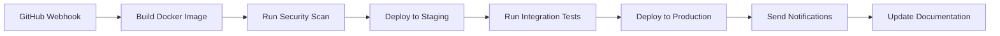

Learn how to combine different executors into powerful automation workflows that solve real-world problems. These examples demonstrate best practices for workflow design and executor orchestration.

## Complete CI/CD Pipeline

A comprehensive deployment workflow that combines multiple executor types for a robust CI/CD process.

### Workflow Overview


### Step-by-Step Implementation

**1. Build Phase (Tool Executor)**
```yaml
name: "build-application"
executor: Tool (Docker)
image: "docker:latest"
script: |
  #!/bin/sh
  docker build -t ${APP_NAME}:${BUILD_VERSION} .
  docker tag ${APP_NAME}:${BUILD_VERSION} ${REGISTRY}/${APP_NAME}:${BUILD_VERSION}
  docker push ${REGISTRY}/${APP_NAME}:${BUILD_VERSION}
arguments:
  - APP_NAME: "${repository_name}"
  - BUILD_VERSION: "${github_sha}"
  - REGISTRY: "${docker_registry}"
```

**2. Security Analysis (AI Agent)**
```yaml
name: "security-analysis"
executor: AI Agent
agent_instructions: |
  Analyze the following Docker image scan results and security report:
  ${security_scan_output}
  
  Provide a risk assessment with:
  1. Critical vulnerabilities that block deployment
  2. Medium/low issues that can be addressed later
  3. Recommended actions for remediation
output_format: JSON
```

**3. Conditional Deployment (jq Processor + SSH)**
```yaml
name: "evaluate-security"
executor: jq Processor
query: |
  if (.critical_vulnerabilities | length) > 0 then
    {deploy: false, reason: "Critical security issues found"}
  else
    {deploy: true, proceed: "Safe to deploy"}
  end

# Conditional deployment step
name: "deploy-to-staging"
executor: SSH
condition: "${evaluate_security.deploy} == true"
host: "staging.example.com"
command: |
  kubectl set image deployment/api-server api-server=${REGISTRY}/${APP_NAME}:${BUILD_VERSION}
  kubectl rollout status deployment/api-server --timeout=300s
```

**4. Integration Testing (Tool Executor)**
```yaml
name: "integration-tests"
executor: Tool (Docker)
image: "node:18-alpine"
script: |
  #!/bin/sh
  npm install
  npm run test:integration -- --env=staging
  echo "Test results: $?"
depends_on: ["deploy-to-staging"]
```

**5. Production Deployment (SSH + HTTP)**
```yaml
name: "deploy-production"
executor: SSH
condition: "${integration_tests.exit_code} == 0"
host: "production.example.com"
command: |
  kubectl apply -f k8s/production/
  kubectl set image deployment/api-server api-server=${REGISTRY}/${APP_NAME}:${BUILD_VERSION}

name: "health-check"
executor: HTTP Request
url: "https://api.production.com/health"
method: GET
timeout: 30
depends_on: ["deploy-production"]
```

**6. Notifications (Slack + LLM)**
```yaml
name: "generate-deployment-summary"
executor: LLM Completion
model: "Claude 3.5 Sonnet"
system_prompt: |
  Create a concise deployment summary for the team.
  Include status, version, test results, and any important notes.
user_prompt: |
  Deployment Details:
  - Application: ${APP_NAME}
  - Version: ${BUILD_VERSION}
  - Security Scan: ${security_analysis.summary}
  - Tests: ${integration_tests.status}
  - Health Check: ${health_check.status}

name: "notify-team"
executor: Slack
operation: "Send Block Kit"
channel: "#deployments"
template: |
  {
    "blocks": [
      {
        "type": "header",
        "text": {"type": "plain_text", "text": "🚀 Deployment Complete"}
      },
      {
        "type": "section",
        "text": {
          "type": "mrkdwn", 
          "text": "${generate_deployment_summary.output}"
        }
      }
    ]
  }
```

## Incident Response Automation

An automated incident response workflow that detects, analyzes, and responds to system issues.

### Workflow Components

**1. Monitoring and Detection (HTTP + jq)**
```yaml
name: "fetch-service-metrics"
executor: HTTP Request
url: "https://monitoring.example.com/api/metrics"
headers: {"Authorization": "Bearer ${MONITORING_API_KEY}"}

name: "detect-anomalies"
executor: jq Processor
query: |
  .services[] | select(.cpu_usage > 80 or .error_rate > 0.05) | {
    service: .name,
    cpu: .cpu_usage,
    errors: .error_rate,
    severity: (if .cpu_usage > 95 or .error_rate > 0.1 then "critical" else "warning" end)
  }
```

**2. Automated Diagnosis (AI Agent + Tool)**
```yaml
name: "collect-diagnostics"
executor: Tool (Docker)
image: "kubectl:latest"
script: |
  #!/bin/sh
  kubectl get pods -n ${SERVICE_NAMESPACE} -o json > /tmp/pods.json
  kubectl describe deployment ${SERVICE_NAME} > /tmp/deployment.txt
  kubectl logs deployment/${SERVICE_NAME} --tail=100 > /tmp/recent_logs.txt

name: "ai-diagnosis"
executor: AI Agent
agent_instructions: |
  You are a DevOps engineer investigating a service incident.
  
  Analyze the following diagnostic data:
  - Pod Status: ${collect_diagnostics.pods_json}
  - Deployment Info: ${collect_diagnostics.deployment_info}
  - Recent Logs: ${collect_diagnostics.recent_logs}
  
  Determine:
  1. Root cause of the issue
  2. Immediate mitigation steps
  3. Long-term prevention measures
```

**3. Automated Response (SSH + Slack)**
```yaml
name: "auto-mitigation"
executor: SSH
condition: "${ai_diagnosis.severity} == 'critical'"
host: "production.example.com"
command: |
  # Auto-scale if resource constrained
  kubectl scale deployment ${SERVICE_NAME} --replicas=${SCALE_REPLICAS}
  
  # Restart if unhealthy
  kubectl rollout restart deployment/${SERVICE_NAME}

name: "create-incident-channel"
executor: Slack
operation: "Create Channel"
channel_name: "incident-${incident_id}"
purpose: "Incident response for ${SERVICE_NAME}"

name: "notify-oncall"
executor: Slack
operation: "Send Direct Message"
user: "${oncall_engineer}"
message: |
  🚨 **Critical Incident Detected**
  
  Service: ${SERVICE_NAME}
  Severity: ${ai_diagnosis.severity}
  
  **AI Analysis:**
  ${ai_diagnosis.root_cause}
  
  **Auto-mitigation:** ${auto_mitigation.status}
  
  Join incident channel: #incident-${incident_id}
```

## Data Pipeline Automation

A comprehensive data processing workflow that ingests, transforms, and analyzes data from multiple sources.

### Pipeline Architecture

**1. Data Ingestion (HTTP + jq)**
```yaml
name: "fetch-sales-data"
executor: HTTP Request
url: "https://api.salesforce.com/data/recent"
headers: {"Authorization": "Bearer ${SALESFORCE_TOKEN}"}

name: "fetch-analytics-data"  
executor: HTTP Request
url: "https://analytics.google.com/api/reports"
headers: {"Authorization": "Bearer ${ANALYTICS_TOKEN}"}

name: "normalize-data-format"
executor: jq Processor
query: |
  {
    sales: ${fetch_sales_data} | .records[] | {
      date: .date,
      amount: .amount,
      customer: .customer_id,
      source: "salesforce"
    },
    analytics: ${fetch_analytics_data} | .data[] | {
      date: .date,
      views: .page_views,
      sessions: .sessions,
      source: "analytics"
    }
  }
```

**2. Data Processing (Tool + LLM)**
```yaml
name: "process-with-pandas"
executor: Tool (Docker)
image: "python:3.11-slim"
script: |
  import pandas as pd
  import json
  import os
  
  # Load normalized data
  data = json.loads(os.environ['INPUT_DATA'])
  
  # Create DataFrames
  sales_df = pd.DataFrame(data['sales'])
  analytics_df = pd.DataFrame(data['analytics'])
  
  # Merge and analyze
  combined = pd.merge(sales_df, analytics_df, on='date', how='outer')
  
  # Calculate metrics
  metrics = {
    'total_revenue': sales_df['amount'].sum(),
    'avg_daily_sessions': analytics_df['sessions'].mean(),
    'conversion_rate': len(sales_df) / analytics_df['sessions'].sum(),
    'top_revenue_days': sales_df.nlargest(5, 'amount')['date'].tolist()
  }
  
  print(json.dumps(metrics))
arguments:
  INPUT_DATA: "${normalize_data_format.output}"

name: "generate-insights"
executor: LLM Completion
model: "GPT-4o"
system_prompt: |
  You are a data analyst generating business insights.
  Focus on trends, opportunities, and actionable recommendations.
user_prompt: |
  Analyze this business data and provide insights:
  ${process_with_pandas.output}
  
  Include:
  - Key performance trends
  - Revenue opportunities
  - Operational recommendations
  - Data quality observations
```

**3. Reporting and Distribution (Slack + HTTP)**
```yaml
name: "create-report"
executor: jq Processor
query: |
  {
    report_date: now | strftime("%Y-%m-%d"),
    executive_summary: "${generate_insights.summary}",
    key_metrics: ${process_with_pandas.output},
    recommendations: "${generate_insights.recommendations}"
  }

name: "distribute-report"
executor: Slack
operation: "Upload File"
channel: "#business-intelligence"
file_content: "${create_report.output}"
filename: "daily-business-report-${date}.json"
initial_comment: |
  📊 **Daily Business Intelligence Report**
  
  ${generate_insights.executive_summary}
  
  **Key Highlights:**
  - Revenue: $${process_with_pandas.total_revenue}
  - Conversion Rate: ${process_with_pandas.conversion_rate}%
  
  Full analysis attached 👆

name: "update-dashboard"
executor: HTTP Request
url: "https://dashboard.example.com/api/update"
method: POST
headers: {"Content-Type": "application/json"}
body: "${create_report.output}"
```

## Infrastructure Monitoring Workflow

A proactive monitoring workflow that continuously checks system health and responds to issues.

### Monitoring Loop

**1. Health Check Collection (Multiple HTTP + jq)**
```yaml
name: "check-api-health"
executor: HTTP Request
url: "https://api.example.com/health"
timeout: 10

name: "check-database-health"
executor: HTTP Request  
url: "https://db-monitor.example.com/status"
timeout: 15

name: "check-cache-health"
executor: HTTP Request
url: "https://redis.example.com/ping"
timeout: 5

name: "aggregate-health-status"
executor: jq Processor
query: |
  {
    timestamp: now,
    services: {
      api: {status: "${check_api_health.status_code}", response_time: "${check_api_health.response_time}"},
      database: {status: "${check_database_health.status_code}", response_time: "${check_database_health.response_time}"},
      cache: {status: "${check_cache_health.status_code}", response_time: "${check_cache_health.response_time}"}
    },
    overall_health: (
      if ("${check_api_health.status_code}" == "200" and 
          "${check_database_health.status_code}" == "200" and 
          "${check_cache_health.status_code}" == "200") 
      then "healthy" 
      else "degraded" 
      end
    )
  }
```

**2. Intelligent Analysis and Response (AI Agent + SSH)**
```yaml
name: "analyze-performance-trends"
executor: AI Agent
agent_instructions: |
  You are a site reliability engineer analyzing system performance.
  
  Current health data: ${aggregate_health_status.output}
  Historical data: ${fetch_historical_metrics.output}
  
  Determine:
  1. Is this a normal fluctuation or a real issue?
  2. What's the likely root cause?
  3. What immediate actions should be taken?
  4. Should we page the on-call engineer?

name: "auto-remediation"
executor: SSH
condition: "${analyze_performance_trends.action_required} == true"
host: "management.example.com"
command: |
  case "${analyze_performance_trends.recommended_action}" in
    "restart_api")
      kubectl rollout restart deployment/api-server
      ;;
    "scale_up")
      kubectl scale deployment/api-server --replicas=${SCALE_TARGET}
      ;;
    "clear_cache")
      redis-cli flushdb
      ;;
  esac
```

## Security Compliance Workflow

Automated security scanning and compliance reporting workflow for continuous security monitoring.

### Security Pipeline

**1. Multi-Source Security Scanning**
```yaml
name: "code-security-scan"
executor: Tool (Docker)
image: "securecodewarrior/security-scanner:latest"
script: |
  #!/bin/bash
  # Static code analysis
  bandit -r /workspace -f json > /tmp/bandit_results.json
  
  # Dependency vulnerability scan  
  safety check --json > /tmp/safety_results.json
  
  # License compliance check
  pip-licenses --format=json > /tmp/license_results.json
  
  # Combine results
  jq -s '{
    code_issues: .[0],
    dependency_vulns: .[1], 
    license_compliance: .[2]
  }' /tmp/bandit_results.json /tmp/safety_results.json /tmp/license_results.json

name: "infrastructure-scan"
executor: SSH
host: "security-scanner.internal"
command: |
  # Container image vulnerability scan
  trivy image ${CONTAINER_IMAGE} --format json > /tmp/image_scan.json
  
  # Kubernetes security check
  kube-bench run --json > /tmp/k8s_security.json
  
  # Network security scan
  nmap -sS -O ${TARGET_NETWORK} > /tmp/network_scan.txt
```

**2. AI-Powered Risk Assessment**
```yaml
name: "comprehensive-risk-analysis"
executor: LLM Completion
model: "GPT-4o"
system_prompt: |
  You are a cybersecurity expert performing risk assessment.
  Analyze security scan results and provide executive-level insights.
  Focus on business impact and prioritized remediation strategies.
user_prompt: |
  Security Scan Results:
  - Code Analysis: ${code_security_scan.output}
  - Infrastructure: ${infrastructure_scan.output}
  
  Provide:
  1. Executive risk summary (2-3 sentences)
  2. Critical issues requiring immediate action
  3. Medium/low priority items for backlog
  4. Compliance status and gaps
  5. Recommended remediation timeline
```

**3. Automated Compliance Reporting**
```yaml
name: "generate-compliance-report"
executor: jq Processor
query: |
  {
    report_metadata: {
      generated_at: now | strftime("%Y-%m-%d %H:%M:%S UTC"),
      report_type: "Security Compliance Assessment",
      assessment_scope: ["code", "infrastructure", "dependencies"]
    },
    executive_summary: "${comprehensive_risk_analysis.executive_summary}",
    findings: {
      critical: "${comprehensive_risk_analysis.critical_issues}",
      medium: "${comprehensive_risk_analysis.medium_priority}",
      low: "${comprehensive_risk_analysis.low_priority}"
    },
    compliance_status: "${comprehensive_risk_analysis.compliance_status}",
    next_actions: "${comprehensive_risk_analysis.recommended_timeline}"
  }

name: "distribute-security-report"
executor: Slack
operation: "Send Message"
channel: "#security-team"
message: |
  🔒 **Weekly Security Compliance Report**
  
  **Status:** ${generate_compliance_report.compliance_status}
  
  **Critical Issues:** ${generate_compliance_report.findings.critical | length}
  **Medium Priority:** ${generate_compliance_report.findings.medium | length}
  
  ${comprehensive_risk_analysis.executive_summary}
  
  Full report: [View Details](${report_url})
```

## Multi-Environment Data Sync

Synchronize data across development, staging, and production environments with validation and rollback capabilities.

### Sync Workflow

**1. Data Export and Validation**
```yaml
name: "export-production-schema"
executor: SSH
host: "production-db.example.com"
command: |
  pg_dump --schema-only --no-owner production_db > /tmp/prod_schema.sql
  pg_dump --data-only --table=config_tables production_db > /tmp/prod_config.sql

name: "validate-data-integrity"
executor: Tool (Docker)
image: "postgres:15-alpine"
script: |
  #!/bin/bash
  # Validate schema consistency
  psql -d temp_db -f /tmp/prod_schema.sql
  
  # Check data consistency
  psql -d temp_db -c "
    SELECT 
      table_name,
      row_count,
      last_updated
    FROM information_schema.tables 
    WHERE table_schema = 'public'
  " --json > /tmp/validation_results.json
```

**2. AI-Powered Migration Planning**
```yaml
name: "analyze-migration-impact"
executor: AI Agent
agent_instructions: |
  You are a database administrator planning a data migration.
  
  Analyze the schema changes and data validation results:
  ${validate_data_integrity.output}
  
  Provide:
  1. Migration risk assessment
  2. Potential breaking changes
  3. Rollback strategy
  4. Estimated downtime
  5. Step-by-step migration plan
tools: ["database-analyzer", "migration-planner"]
```

**3. Staged Deployment with Verification**
```yaml
name: "deploy-to-staging"
executor: SSH
host: "staging-db.example.com"
command: |
  # Create backup point
  pg_dump staging_db > /tmp/staging_backup_$(date +%s).sql
  
  # Apply migration
  psql -d staging_db -f /tmp/prod_schema.sql

name: "verify-staging-deployment"
executor: HTTP Request
url: "https://staging-api.example.com/health/database"
method: GET
timeout: 30

name: "staging-smoke-tests"
executor: Tool (Docker)
image: "newman/newman:latest"
script: |
  newman run /tests/api-smoke-tests.json \
    --environment /tests/staging-env.json \
    --reporters json > /tmp/test_results.json

name: "production-deployment-approval"
executor: LLM Completion
system_prompt: |
  Review deployment results and provide go/no-go recommendation.
user_prompt: |
  Staging Deployment Results:
  - Health Check: ${verify_staging_deployment.status}
  - Smoke Tests: ${staging_smoke_tests.output}
  - Migration Analysis: ${analyze_migration_impact.output}
  
  Should we proceed with production deployment? Provide reasoning.
```

## Workflow Design Patterns

### Pattern 1: Fan-Out Processing
Execute multiple parallel operations and aggregate results.

```yaml
# Trigger multiple parallel scans
parallel_steps:
  - security_scan
  - performance_test  
  - compliance_check

# Aggregate results
name: "combine-results"
executor: jq Processor
depends_on: ["security_scan", "performance_test", "compliance_check"]
query: |
  {
    security: ${security_scan.output},
    performance: ${performance_test.output},
    compliance: ${compliance_check.output},
    overall_status: (
      if (.security.status == "pass" and 
          .performance.status == "pass" and 
          .compliance.status == "pass")
      then "approved"
      else "rejected"
      end
    )
  }
```

### Pattern 2: Error Recovery Chain
Implement graceful error handling with multiple fallback options.

```yaml
name: "primary-deployment"
executor: SSH
host: "primary.example.com"
on_failure: "fallback-deployment"

name: "fallback-deployment"
executor: SSH
host: "secondary.example.com"
on_failure: "emergency-notification"

name: "emergency-notification"
executor: Slack
operation: "Send Message"
channel: "#critical-alerts"
message: "🚨 All deployment targets failed for ${service_name}"
```

### Pattern 3: Conditional Workflow Routing
Route workflow execution based on data-driven decisions.

```yaml
name: "environment-detector"
executor: jq Processor
query: |
  if .git_branch == "main" then "production"
  elif .git_branch == "develop" then "staging"  
  else "development"
  end

name: "production-deployment"
executor: SSH
condition: "${environment_detector.output} == 'production'"
host: "prod.example.com"

name: "staging-deployment"  
executor: SSH
condition: "${environment_detector.output} == 'staging'"
host: "staging.example.com"
```

## Workflow Optimization Tips

### Performance Best Practices
- **Parallel execution** - Run independent steps simultaneously
- **Early termination** - Use conditions to skip unnecessary steps
- **Caching** - Store intermediate results for reuse
- **Resource pooling** - Reuse connections and containers when possible

### Reliability Patterns
- **Retry logic** - Handle transient failures automatically
- **Circuit breakers** - Prevent cascade failures
- **Health checks** - Verify system state before proceeding
- **Rollback mechanisms** - Provide recovery paths for failures

### Monitoring and Observability
- **Step timing** - Track execution duration for optimization
- **Error tracking** - Log and analyze failure patterns
- **Resource usage** - Monitor CPU, memory, and network utilization
- **Workflow metrics** - Measure success rates and performance trends

---

**Next:** Return to [Workflow Designer Overview](/composer/workflow-designer) or explore [Advanced Workflow Concepts](/workflows/advanced).