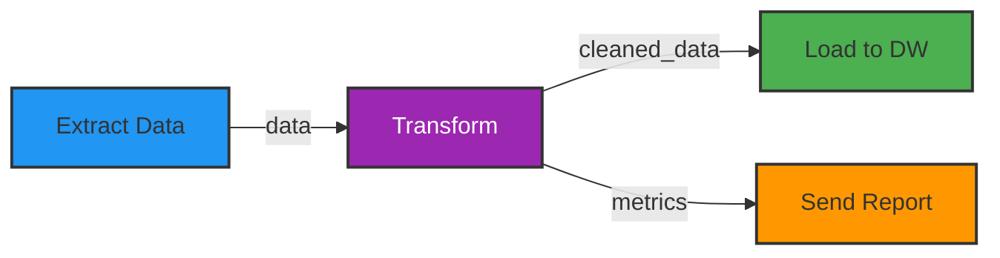
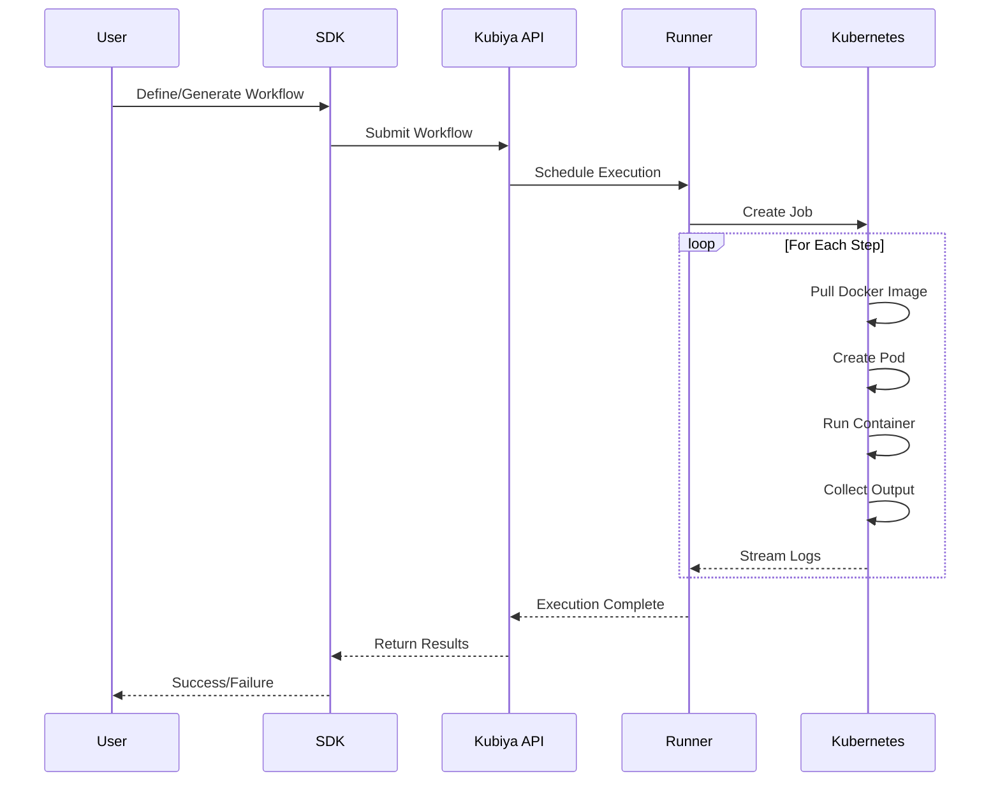
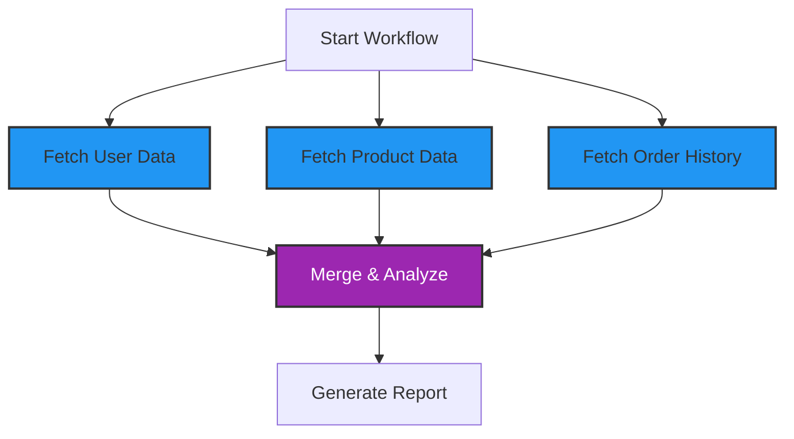
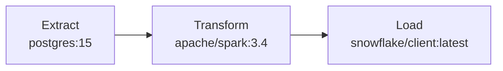
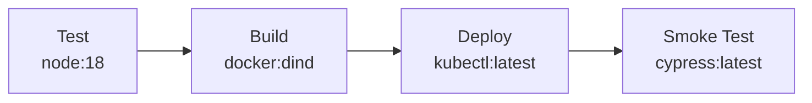
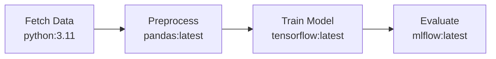

# Workflows Overview

Kubiya workflows are the foundation of intelligent automation. They combine the power of AI generation with the reliability of deterministic execution, all running in containerized environments.

## The DAG Revolution

```mermaid
graph TB
    subgraph "Traditional Script"
        S1[Linear Script]
        S2[Step 1]
        S3[Step 2]
        S4[Step 3]
        
        S1 --> S2
        S2 --> S3
        S3 --> S4
        
        S2 -.->|"Fails?"| FAIL1[Entire Script Fails]
    end
    
    subgraph "Agent Framework"
        A1[Agent Decision]
        A2[Maybe Step A]
        A3[Or Step B?]
        A4[Loop Forever?]
        
        A1 --> A2
        A1 --> A3
        A2 --> A4
        A3 --> A4
        A4 --> A1
        
        A4 -.->|"Lost?"| CHAOS[🌪️ Chaos]
    end
    
    subgraph "Kubiya DAG"
        K1[Define Workflow]
        K2[Step 1: Container A]
        K3[Step 2: Container B]
        K4[Step 3: Container C]
        
        K1 --> K2
        K2 --> K3
        K2 --> K4
        K3 --> SUCCESS[✅ Predictable Success]
        K4 --> SUCCESS
        
        K2 -.->|"Fails?"| RETRY[Retry with Backoff]
        RETRY --> K2
    end
    
    style FAIL1 fill:#FF5252,stroke:#333,stroke-width:2px,color:#fff
    style CHAOS fill:#FF5252,stroke:#333,stroke-width:3px,color:#fff
    style SUCCESS fill:#4CAF50,stroke:#333,stroke-width:3px,color:#fff
```



## What is a Kubiya Workflow?

A workflow in Kubiya is:

- **Directed Acyclic Graph (DAG)**: Steps with dependencies, no circular references
- **Container-Based**: Each step runs in its own Docker container
- **Language Agnostic**: Use Python, Go, Node.js, or any language
- **AI-Generated**: Created from natural language or defined programmatically
- **Deterministic**: Same input → Same execution → Same output

## Core Components

### 1. **Workflow Definition**

```python
from kubiya_workflow_sdk import workflow

my_workflow = workflow("my-workflow-example")
```

### 2. **Steps**

Each step is an atomic unit of work:

```python
from kubiya_workflow_sdk import step

data = step("extract-data").docker(
    image="python:3.12",
    command="python extract.py"
)
```

### 3. **Dependencies**

Steps can depend on outputs from other steps:



### 4. **Containers**

Every step runs in isolation:

<CardGroup cols={3}>
  <Card title="🐳 Any Docker Image" icon="docker">
    Public or private registries
  </Card>
  <Card title="🔒 Complete Isolation" icon="lock">
    No shared state between steps
  </Card>
  <Card title="📦 Dependency Freedom" icon="box">
    Each step has its own environment
  </Card>
</CardGroup>

## Workflow Execution Model



## Key Features

### Parallel Execution

Run independent steps simultaneously:



### Conditional Logic

Dynamic paths based on results:

```python
if data.quality_score > 0.8:
    step("deploy")
else:
    step("alert")
```

### Error Handling

Built-in retry mechanisms:

```python
step(
    "critical_operation"
).retry(limit=3)
```

### Inline AI Agents

Embed intelligent decision-making:

```python
analysis = step("critical_operation").inline_agent(
    agent_name="analyzer-agent",
    ai_instructions="You are an expert in log analysis.",
    message="Analyze these logs for anomalies",
    runners=["kubiya-hosted"],
    tools=[],
)
```

## Workflow vs Other Approaches

<ComparisonTable>
  <Row>
    <Cell>Feature</Cell>
    <Cell>Bash Scripts</Cell>
    <Cell>Agent Frameworks</Cell>
    <Cell>Traditional DAGs</Cell>
    <Cell>Kubiya Workflows</Cell>
  </Row>
  <Row>
    <Cell>Execution Model</Cell>
    <Cell>Linear, single process</Cell>
    <Cell>Non-deterministic</Cell>
    <Cell>Fixed DAG</Cell>
    <Cell>Dynamic DAG + Containers</Cell>
  </Row>
  <Row>
    <Cell>Error Recovery</Cell>
    <Cell>Manual scripting</Cell>
    <Cell>Agent "figures it out"</Cell>
    <Cell>Basic retry</Cell>
    <Cell>Smart retries</Cell>
  </Row>
  <Row>
    <Cell>Language Support</Cell>
    <Cell>Bash only</Cell>
    <Cell>Framework language</Cell>
    <Cell>Usually Python</Cell>
    <Cell>Any language/tool</Cell>
  </Row>
  <Row>
    <Cell>AI Integration</Cell>
    <Cell>None</Cell>
    <Cell>Chaotic</Cell>
    <Cell>None</Cell>
    <Cell>Structured inline agents</Cell>
  </Row>
  <Row>
    <Cell>Production Ready</Cell>
    <Cell>No</Cell>
    <Cell>No</Cell>
    <Cell>Yes, but complex</Cell>
    <Cell>Yes, simple</Cell>
  </Row>
</ComparisonTable>


## Benefits of Kubiya Workflows

### 1. **Predictability**
- Deterministic execution paths
- No agent wandering or infinite loops
- Clear audit trails

### 2. **Flexibility**
- Use any programming language
- Integrate any tool or service
- Mix AI and traditional logic

### 3. **Scalability**
- Parallel execution by default
- Kubernetes-native scaling
- Efficient resource usage

### 4. **Maintainability**
- Version control friendly
- Easy to test and debug
- Clear dependencies

## Common Patterns

### ETL Pipeline


### CI/CD Pipeline


### Data Science Pipeline


## Next Steps

Ready to build your first workflow?

<CardGroup cols={2}>
  <Card title="Workflow Architecture" icon="building" href="/workflows/architecture">
    Deep dive into execution model
  </Card>
  <Card title="DSL Reference" icon="code" href="/workflows/dsl-reference">
    Complete workflow syntax guide
  </Card>
  <Card title="Examples" icon="lightbulb" href="/workflows/examples">
    Real-world workflow patterns
  </Card>
  <Card title="Quick Start" icon="rocket" href="/getting-started/quickstart">
    Build your first workflow
  </Card>
</CardGroup> 